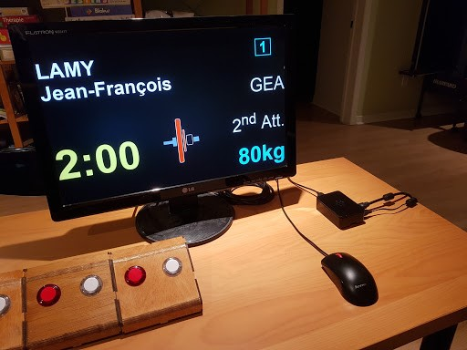

# Setting up OWLCMS

This page gives you access to a set of PDF documents that provide the necessary information to run a competition.

## Pre-Requisites
####Equipment
+    You need a recent-enough laptop, typically with a Core-i5 and 4GB of memory, to run the server.

####A Quick Read
+	If you are intimately familiar with running Web Server Software, you may skip this section.  But then again, if so, you'll probably be curious and look at the documents anyway.
+   See the [Equipment Setup](#Equipment_Setup) section at the bottom of this page which explains how owlcms works in more detail. This will help making sense of the steps below. The document includes pretty pictures and discusses options for Equipment from the most basic to the most elaborate.

## Windows Installation
+	An [Installer](https://sourceforge.net/projects/owlcms2/) for Windows can be downloaded from this [location](https://sourceforge.net/projects/owlcms2/) (use the green button from a Windows laptop).
+	__You need to have installed Java 8, 32-bit version__ (whether or not you have a 64-bit computer).  To perform this installation, go to [Java 32-bit installer download](https://java.com/en/download/manual.jsp) and select one of the first two options ("Windows" or "Windows Offline")
+	Install the 32-bit version of Java you downloaded above.
+   Most people use the Windows installer with all the default options. A full walk-through of the process is available: [Installation Guide](pdf/Installation.pdf)
+	If, when you exit the installer there is no black window with text, and later attempts to start the program do not show a "barbell" icon in the taskbar at the bottom of the screen, this means with very high probability that Java was not installed properly.  First seek help from a knowledgeable friend and, as failing that, from the owlcms group -- see the "Support" entry in the menu on the top of this page.

## Mac Installation
####Installing a Web Server
owlcms runs on a web server.  Your Mac will act as a Web Server, so we need to install web server software.
The web server software we use is called "Tomcat Server", or "Tomcat" for short.

+	From the App store, download Bitnami Stack for Tomcat
+	Once installed, run the application, and go to Manage Servers.
	+	Start the Tomcat server
	
#### Download OWLCMS

+	Download the latest release of OWLCMS from https://sourceforge.net/projects/owlcms2/files/
	+	Look for the most recent 2.19.x directory, and click on it
	+	Download the file with a name that ends in .war (for example owlcms-2.19.9.war)
	+	Once downloaded, __rename the file to__ `owlcms.war`, we don't want the version number in the file name
+	Start a browser on the machine where you just installed Tomcat  
	+	will then need to log into the Tomcat manager account to install OWLCMS.  This is done by using the following URL
```
http://localhost:8080/manager/
```
If you selected a different port number than the default (8080), you need to replace 8080 with what you selected
	+	Use the following information to login
```
username: manager
password: bitnami
```
+	In the Tomcat manager, scroll down to 'Deploy'
+	In the "WAR File to deploy" section, select the file you've just downloaded, and click Deploy.
+	If everything was successful, you should now see it at the bottom of the list of Applications

#### Initial test
+	Use your browser to go to 
```
http://localhost:8080/owlcms/app/
```
to view the server. __Be careful, you need the /app/ at the end of the URL, including the trailing /__
+	Go to the [Running a Competition](Running.md) page and follow the instructions.

## Linux Installation
+	First, you will need to install the Oracle distribution of Java -- the reason for this has to do with sound management, see below. See https://tecadmin.net/install-oracle-java-8-ubuntu-via-ppa/# for instructions.
+	The next steps are the same as described above for a Mac.
+	In order to get sound to work, you will need the following steps
	1.	Add tomcat7 to audio group by 
	
	sudo adduser tomcat7 audio
	
	2.	Add the following line to each of the classes in /var/lib/tomcat7/conf/policy.d/03catalina.policy.  In other words, edit that file, and under each of the lines that starts with `grant codebase ... {` insert an additional permission line as follows:

	permission javax.sound.sampled.AudioPermission "TomcatSound", "play";


## Equipment Setup
Owlcms can handle all sizes of competition, from a club meet run on a single laptop to a multiple-day national championship.
An [Equipment Setup](pdf/HardwareAndNetworkingSetup.pdf) document describes these various setups.


## Using Raspberry Pi to Drive Displays
Instructions for using [Raspberry Pi](Raspberry Pi.md) as cheap computers to drive the competition displays is available [here](Raspberry Pi.md).


